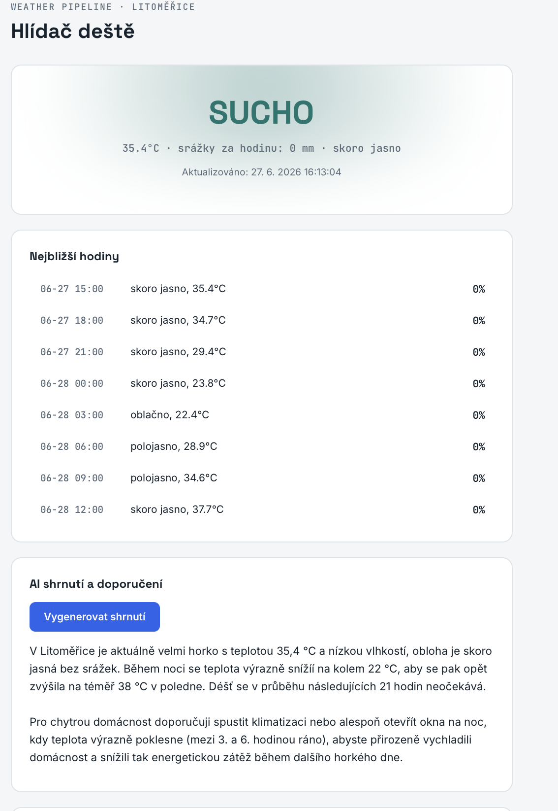

# Weather Pipeline

End-to-end projekt: stahuje počasí z externího API, ukládá historii do
databáze, nabízí ji dál přes vlastní zabezpečené REST rozhraní, umí
vygenerovat AI shrnutí a má jednoduchý webový dashboard. Postavený jako
konkrétní demonstrace dovedností požadovaných na pozici **IT Analytik
API & Data management** (Škoda Auto).

## Architektura
